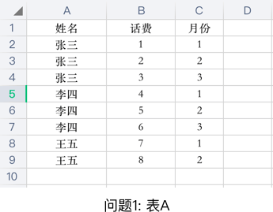
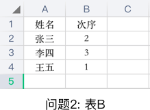
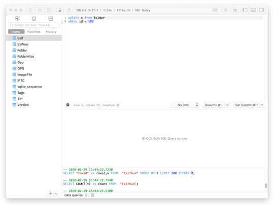
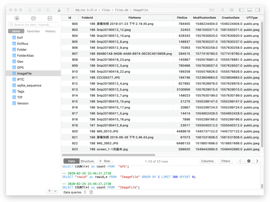
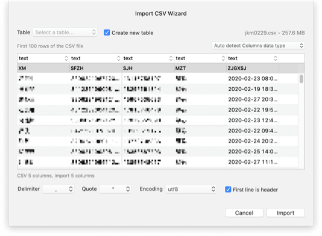

约莫有一两载，在琢磨这个问题，但总是没有找到合乎心意的方法，直到这次，才稍有眉目，并认为是一种适合自己的路径。平常工作中，常遇XLS表、CSV文件、TXT文件等结构化数据，有从信息系统中导出的，有从同事整理传递过来的，往往需要进行二次的整理统计。<!-- more -->简单的逻辑，EXCEL或者WPS的导入、排序、筛选、公式计算下拉自动填充、导出能够解决，但对于稍微复杂些的问题，还仅仅基于这些，就会耗费比较长的时间。

### 问题1: 分组归类统计
假设有一个EXCEL表A，有三列数据，一列为姓名，一列为话费，一列为月份，现需计算每个人的总话费清单。简单的处理是，对姓名进行筛选，再对话费这一列进行求和。如果有成千上百个人，这样的工作量是巨大的。



### 问题2: 多表联合查询
假设有两个EXCEL表，一个如问题1中的表A，还有一个表B，有两列，一列是姓名，另一列为姓名排列的次序值，现要求表A按照表B中姓名的次序大小排列。朴素的处理是，利用[VLOOKUP](https://support.office.com/zh-cn/article/vlookup-%E5%87%BD%E6%95%B0-0bbc8083-26fe-4963-8ab8-93a18ad188a1)函数，依据姓名关键字，取B表中的次序值到A表中的最后一列，再拖动鼠标智能填充到每一行，然后按照该列值从小到大排序。同样的，当数据量大、很多行时，智能填充一直拖动鼠标到最后一行，是比较费劲的(可能是没有找到简便的方法)，还有一个麻烦问题是，当需要取多列数据，或者有多于两个表关联时，这样的处理手段就显得捉襟见肘了。



## 解决方法摸索

### 方法1: 宏VBA
面对这些刺手的问题，使用EXCEL的，可以启用宏，而使用WPS的，也可以安装相应的插件启用宏，但是截止2019版对VBA的支持还是不完善的，所以要慎用。而对于宏VBA脚本，是不太熟悉的，所以没去尝试。

### 方法2: EXCEL中执行SQL
而我本身对SQL比较熟悉，遂思考能否在EXCEL或者WPS中直接写SQL语句查询，经过一番搜索，发现，在EXCEL中"数据->来自其他源->来自Microsoft Query"是可以的，但是比较繁琐，并且自由度低，对于多表反复查询分析的数据，操作界面不直观，而WPS，没有找到相关的使用说明，大概率是不支持。而且不管是EXCEL还是WPS单表都是有数据行限制的，XLS最多支持65536行，XLSX最多支持1048576行，并且数据量过大，操作必然卡顿。面对大量的数据，多表的情况，利用数据库，看来是必然的选择。

### 方法3: 建立数据库执行SQL
对于关系式数据库有多种选择，有Oracle, MySQL, SQL Server等常用的，但这些似乎未免太重型了，数据库的建立管理是一个问题，数据的分享是一个问题，一系列的软件安装是一个问题，似乎为解决一个问题又产生另外的一些问题，因此，是比较排斥的。那么，有没有比较轻量的数据库，可以像常规办公软件那般操作？

1. 数据库文件在磁盘上以单个文件形式存在，可以像XLS、CSV、TXT文件一样分享、传递、移动、复制等。
2. 不需要安装庞大的数据库管理软件，以致每次使用前，还需要启动这些软件。
3. 只需要安装一个数据库的客户端软件，如XLS、WORD样，对相应的数据库文件双击就能打开，进行表查询、SQL语句编写、统计。

答案是有的，这里推荐[SQLite](https://www.sqlite.org/index.html)，而它，对于我，真是近在眼前，远在天边，大概2011年时，移动开发时就接触了，而且一直在那，却一直没想到，如今，以这样重办公轻开发的形式，再次来到眼前，更感觉它设计的巧妙，弥补了常规EXCEL到大型数据库之间数据统计的鸿沟。

## 结构化数据[SQLite](https://www.sqlite.org/index.html)查询统计实践

### 结构化数据预处理
一般收到的都是结构化的数据，不需要经过特殊处理，可以直接入库。XLS/XLSX在导入[SQLite](https://www.sqlite.org/index.html)前，需要先导出成CSV文件，CSV、TXT文件一般是可以利用数据库客户端软件直接导入数据库的。也有些情况下，需要对某一列字段进行预处理，或者需要把多个结构化文件合成一个的，这时就用到Python，它可以对数据、文件进行一些预处理。Python处理CSV, TXT文件是简单的，直接进行文件的读取，字符串的处理，保存成相应格式的CSV文件就可以。而XLS/XLSX文件，Python也有相对应的库包进行读取和写入，分别有[xlwt](https://xlwt.readthedocs.io/en/latest/)/[xlrd](https://xlrd.readthedocs.io/en/latest/)和[openpyxl](https://openpyxl.readthedocs.io/en/stable/tutorial.html)，这里推荐[openpyxl](https://openpyxl.readthedocs.io/en/stable/tutorial.html)包，因为[xlwt](https://xlwt.readthedocs.io/en/latest/)/[xlrd](https://xlrd.readthedocs.io/en/latest/)有65536数据行的限制，而[openpyxl](https://openpyxl.readthedocs.io/en/stable/tutorial.html)的限制是1048576行。以下摘录一段将一个文件夹下多个XLSX文件合成一个CSV文件的Python函数。

```python
def export_csv(dirPath, totalDir):
	csvPath = dirPath + '/' + str(datetime.date.today()) + '.csv'
	csvFile = open(csvPath, 'wb')
	csv_write = csv.writer(csvFile)
	csv_head = ["city","name","type","status","stateDate","endDate"]
	csv_write.writerow(csv_head)
	for fileName in os.listdir(totalDir):
		if fileName.endswith('.xlsx'):
			filePath = totalDir + '/' + fileName
			print(filePath)
			xlsFile = openpyxl.load_workbook(filePath)
			xlsFileSheet = xlsFile.active
			for row in xlsFileSheet.iter_rows(min_row=2):
				item = []
				for cell in row:
					item.append(cell.value)
				csv_write.writerow(item)
			#break
	csvFile.close()
	print 'save success', csvPath
```

### 结构化数据入库查询
完成结构化数据的准备，就开始入库。这里使用[TablePlus](https://tableplus.com/)客户端，打开客户端，新建连接，选择[SQLite](https://www.sqlite.org/index.html), 选择数据库文件的保存路径，建库。然后就可以File->Import->From CSV 找到CSV文件进行相应的导入。导入后，刷新下，在左边面板中可以看到相应的导入的表，点击表名，可以进行数据条目的浏览；点击左边面板头部的**SQL**，右边出现的面板，可以进行SQL语句编写和执行。







### 查询结果导出导入EXCEL
对于熟悉SQL操作的，可以直接把数据库文件和SQL脚本拷贝给他，进行相应的查询统计；而对于需要EXCEL的，可以先导出成CSV文件，再在EXCEL中导入，然后把结果分享给他。这里需要注意的是。

1. CSV文件导入EXCEL时，每列数据格式的设置，建议文本。
2. OSX系统下，WPS2019版本目前还不支持数据的导入。
3. XLS/XLSX数据行数的限制，因此务必注意导出数据条目数量。


## 总结
对于统计复杂的EXCEL问题、或者大量数据的情况下，总算摸索出了一条适合自己的路径。

1. 结构化数据的准备，EXCEL表导出CSV文件，Python脚本预处理等。
2. [TablePlus](https://tableplus.com/)客户端建立[SQLite](https://www.sqlite.org/index.html)数据库文件，连接，导入表数据。
3. 进行SQL语句的编写，查询，统计等。
4. [TablePlus](https://tableplus.com/)查询结果的导出，EXCEL导入外部数据。

这条路径的前提条件，是对SQL语句比较熟悉。如果没这方面的经验，这是一条不归路。

赤探 2020年2月29 绍城