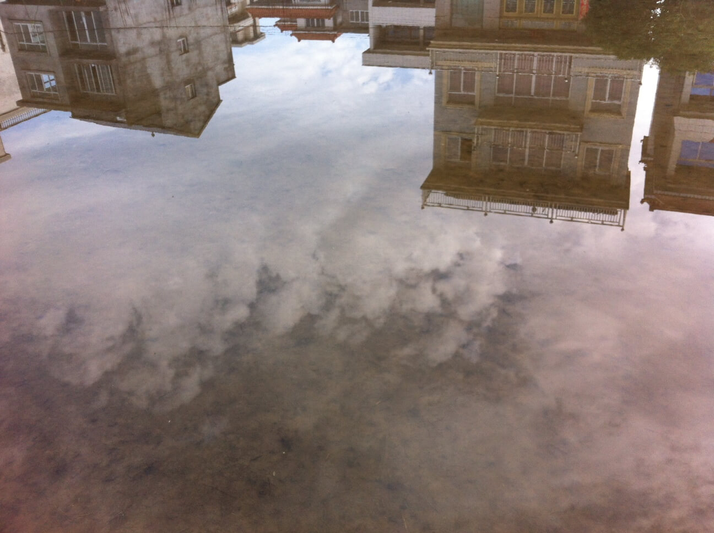

冬日暖阳，天空清晰，晌午，父亲、母亲、妻子、我一同走在路上，去往村外的田地，挖荸荠。父亲独自扛着锄头走在前头，母亲提着篮子，妻子紧随母亲，而我拖拉在后。<!-- more -->路程过半，母亲回过身，踉踉跄跄到我这边，煞有介事但带笑地，指着远处山腰跟我说：你看，那就是老年坟陵，村里建的，我和你爸定了两座，已经交过钱。我轻轻嗯了声，没有接话，看了看不远处那座崭新的坟陵。

赤探 2014年7月2日 老家

