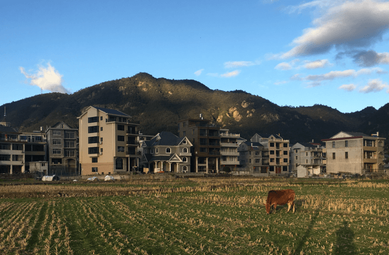

冬日下午，阳光乏力地照在田野上，背阴的山脚已得不到它的眷顾，时有阵风泛起，扰地电线上歇息的麻雀不停飞起。割完稻的田地，留下稻梗，经过大半个冬季的休整，布满青草，一头老黄牛迎着阳光，摇摆着尾巴，悠闲地啃食青草。<!-- more -->我与儿子常来这里放风筝，趁着年假，又是好时光，是不会放过这样的时机的。

好不容易翻出鲸鱼样，背蓝色，底白色，线六根，两侧各三根牵引，圆形握手轮滑调节线长，裹缩着的风筝。还未完全展开，他就一把拉拾起鲸尾，催促着赶紧走，我只好就着未理顺的筝线，提着鲸头，一前一后，向着田地进发。顺着风，走在田间，一深一浅，一大一小，向着更宽广的地方走去。待到合适位置，停下，理顺线，转动圆形轮滑稍稍调长牵引线，儿子举高鲸头，我握着滚轮，拉起牵引线，向着鲸头，待势，等风来。要一会等，儿子常絮叨，“风为什么还没来，还没来...”,不烦间，风就来了，蹲握在电线上的麻雀飞起，一叫儿子放手，我便侧身跑动起来，迎着风的鲸鱼，展开身躯，变得巨大起来，儿子追逐着鲸鱼的尾巴，嚷嚷着，“飞起来，飞起来了，大鲸鱼飞起来了...”。我时不时低头，生怕踩到牛粪，谨慎地调整脚步，顺着风势，收放筝线，使鲸飞得更高。

至今，始终也没有将鲸鱼放高远。每次，不是一个疾风过来，吹歪四五米高的鲸头，使风筝一头扎下来，就是风静止下来，飞高的风筝，不管怎么收放线，鲸鱼都会徐徐地搁浅在田野上。我想是未把握风向，不得放风筝的要领。儿子却未曾嗔怪，也许他还不知道风筝能飞的那么高远，高远到看不清鲸鱼的模样，也许他知道，只是更喜欢追着鲸鱼的尾巴跑。

这次，我飞过一次后，儿子就要求自己牵跑着风筝飞，他时不时没等风来就开跑，拖着鲸鱼在田野上迤逦，来回了多次，才飞起了鲸鱼。田野上奔跑着他，向着风筝，笑逐颜开，我实在跟不上，瘫坐田头，偷息，欣赏着，希望他不要踩到牛粪。

赤探 2020年1月30 初六晚 春节期 绍城

