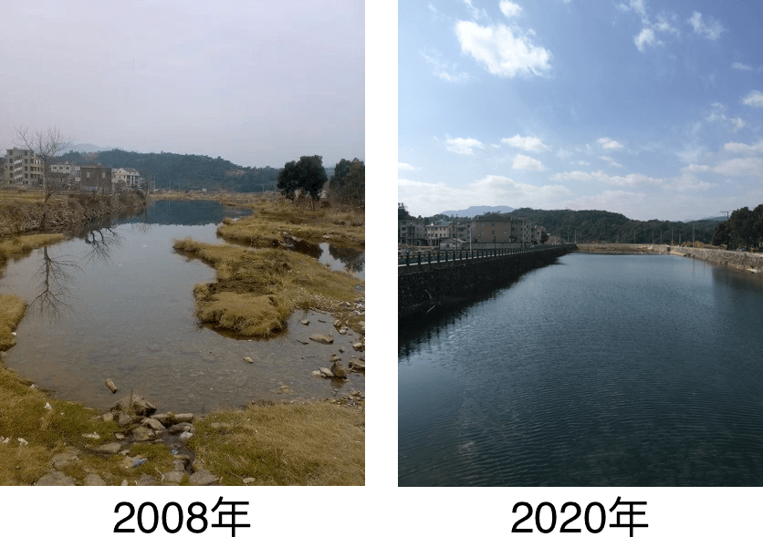

村里其实没有严格意义的古迹，只是有些先辈门生活生产遗留下来的老物件、印记，而这些也随着近二三十年的变化，逐渐消失，以使之对以前越来越模糊，直至不再有人挂念。<!-- more -->

村庄，四面环山，依西南山旁，顺山势，族簇居而建，溪流自东向西弯过，汇入芙蓉池。宗祠记载，宋始有村，南迁避难而来，时至今日，两大宗氏繁昌。

房屋。有了钱，想必先盖房，村子里大多人的朴素想法，就像婴儿一生下来吸食奶头，那般本能，所以就几乎没有什么老屋遗留，但如果仔细寻找，还能见些踪迹，可见当年端倪。

沿着山腕，半壶型，走走停停，偶尔能见到倒塌的石墙，残破低矮地簇拥成方型，倒塌彻底的，裸露出房基，经年累月的腐叶，厚厚地覆盖在方型内，滋养着几株灌木，已揣不出屋子什么模样，什么年代，只有那断壁残垣宣示着曾有人栖息，存在。

沿着山脚，间歇俯卧着几座石墙木梁黑瓦的老屋，这类型老屋通常由正房、左右两翼的侧房构成，总体成“冂”型，正房对着大门，大门两侧用石头垒成一人多高的围墙，延伸至两翼的侧房壁，正房、侧房、围墙包拢出中间的一块空地，嵌满稀稀疏疏而平整的石块。

岁月的打磨，石壁、石块显得青灰，不染尘土，而藤蔓则攀附上了墙头，青苔爬附上了墙根，荒败的杂草拥挤在空地的石缝上。雨水风霜侵蚀，有些侧房梁已蛀蚀折损，瓦片倾斜下来，散落在地上，相互叠覆着，伴着几枝错落有致蕨类。正房的屋顶两脊角连成弧线，指向天空，屋楞上时有瓦片破碎，山间晨光透过，斑驳地照射在黄泥垒成的墙壁上，布满蛛丝的墙壁，坑坑洼洼，脱落的黄泥细碎地落在地上，似蚂蚁翻腾过。

站在侧房屋檐下，环顾四周，仿佛看见，门梁下，一位孩童俯身将头靠在母亲拱起的膝盖上，而母亲则倚坐在矮椅上，低头拨弄着孩童浓密的头发，仔细找寻虱子，两位佝偻的老巫斜对大门、背对矮墙站着，双手撺握着暖炉，絮叨着，正享受着暖暖的冬日阳光。

老屋一般栖居着好几户，一户占居一间，一间分上下两层，楼层木板隔开，纵深五六米，垂直最高处四五米，底层有灶台、就食木桌，洗漱台架等，上层主要用于起卧，并开有可左右移动不透光的木窗。

我猜测他们大概是旧时代建筑，时至今日，仅剩的几座大都也已荒废，偶尔能瞥见竖立起的竹杆，凉挂着衣物，大多数房户已外迁，或者拆掉部分，建起钢筋水泥的楼房，与剩下几间的侧房、正房连依着，诉说着时代的变迁。

山脚外沿，偶尔坐落着几栋青砖黑瓦石灰小楼，楼两层，下层混泥土石灰青砖，上层架设房梁，搭建瓦楞，铺设瓦片，楼层间木板隔断，混泥土楼梯折一个弯上到二层，二层设有阳台，阳台外栏镂空，并镶有破碎的彩色玻璃、斑斓的石英石等，呈现朴素的纹理。估计建于七八十年代，至今大多保存完好，若有人常住，收拾得当，炊烟袅袅升起，也会显得奕奕昂然。

路，走的人少了，便没有了路，走的人多了，就更加宽阔硬朗起来。村子里的路，也是如此，上山砍柴的路，杂枝横生，不几年，就淹没在茫茫的山丛中，没了踪迹。出村的羊肠小道，不仅水泥硬化，还装起了路灯，从只容纳开辆拖拉机，扩宽到能两辆轿车相向开。铺满石板的小巷，同青苔在荡漾，小鲵在逗留的沿路水渠，一起埋进了混泥土。冬雨初歇，湿漉漉的石板，光滑清亮，沿路的渠道流淌着从山上汇集下来的雨水，不急不慢，浸润着石墙，不见这样的景象。破败的老屋旁，蜿蜒着几段，仅存的石板巷子，不过，杂草爬满，淤泥积满水渠。

老的物件总是要被抛弃。大年初二，我徜徉在村里，在一座侧房倒塌的老屋前，瞧见一位老太靠坐在矮椅上，一动不动，框住没有贴春联的门柱、没有放鞭炮的空地，似乎使得时间也没有在这里拨动过。

几百年的迭代演进，二三十年的快速突变，实在抓不住曾经的身影，不过，对于我，大抵如此。但对于田间追逐打闹的孩子们，以后应是不一样的，走在村子巷间，离去归来的他们，恐怕不会如我这般陌生，还是他们不在再归来，或不必离去，但最终都会像老屋前的老太，也成为老物件。

赤探 2020年1月28晚 初四 春节期 老家

