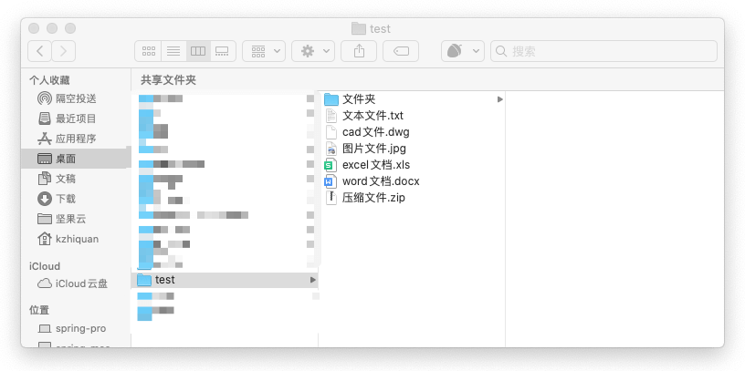
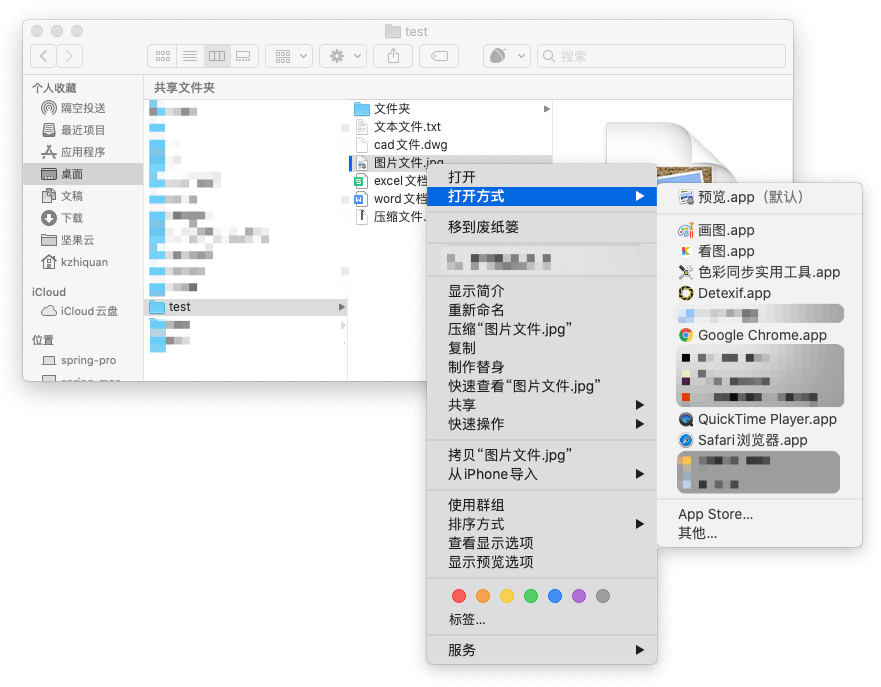
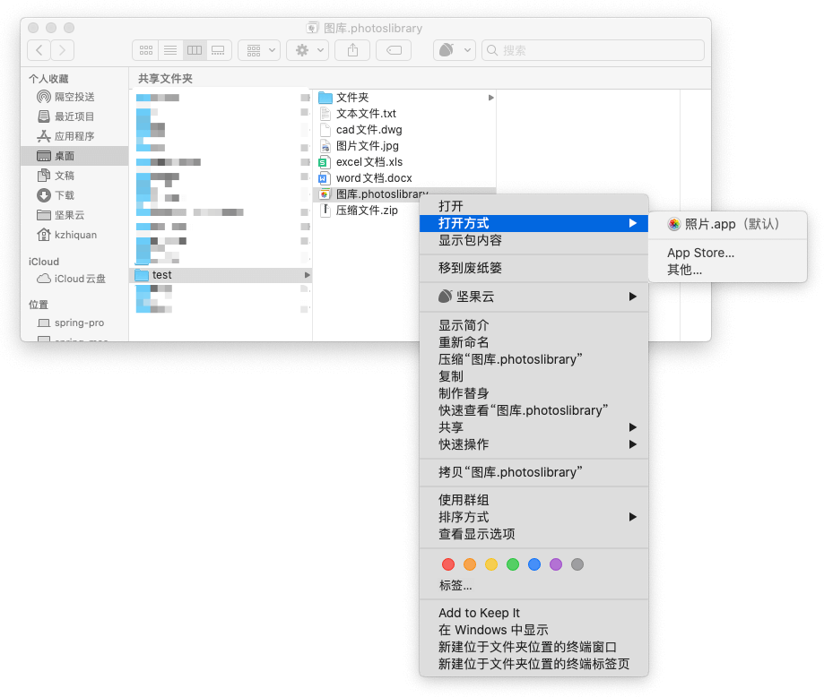
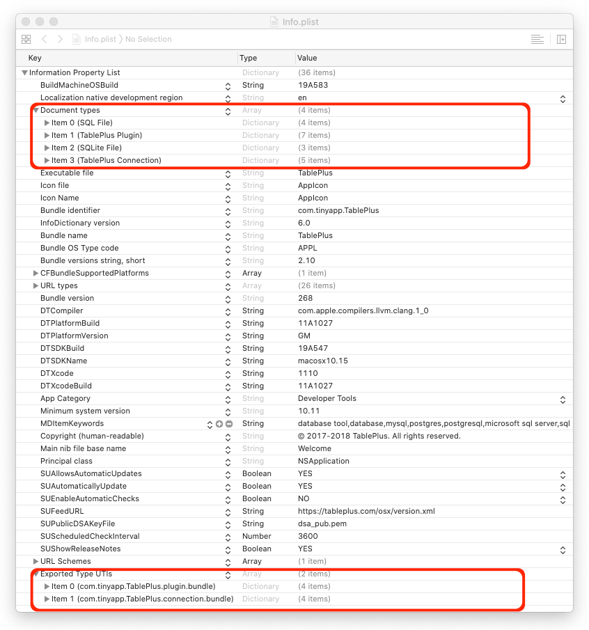
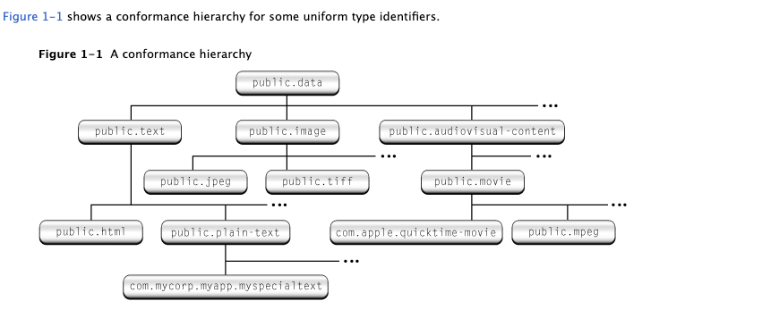
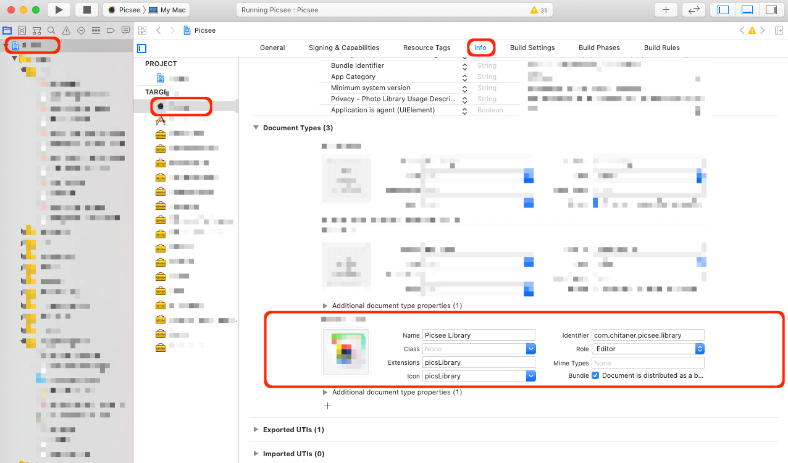
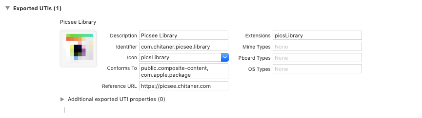

平日工作中，用Word打开.doc, docx文档文件，用PhotoShop打开.jpg, .png图片文件，用AutoCAD打开.dwg, .dwt绘图文件，我们用不同的软件打开不同类型的文件，并且文件夹中还躺着其它各种各样的，以扩展名为标识的文件，例如.txt, .zip等，在macOS下，这些都是Document Types的展现，其本质是对不同数据结构的表示，而在操作系统和App层面，是通过UTIs(Uniform type identifiers)定义和支持的。<!-- more -->



macOS上，不同扩展名的文件，在Finder中，是以默认打开App的图标显示的，并且在选中右键菜单打开方式中，罗列了支持打开该文件的其它App，而且对于带扩展名的文件夹，其表现逻辑也可以与文件是一致的。这些特性，都是在App中Info.plist对Document Types, Exported UTIs, Imported UTIs不同配置实现的。







## Document Types, Exported UTIs, Imported UTIs逻辑阐述
### Document Types
Document Types通过UTI定义，开发文档中对UTI表述是：它是一个字符串，能够唯一地标识一种数据格式，这种数据格式可以是一个单文件，也可以是一些文件夹的组织，它提供了App识别数据一种方式。

UTI字符串采用reverse-DNS格式，例如com.apple.quicktime-moive, public.jpeg, public.text，它们都代表了一种数据格式, com.apple.quicktime-moive代表视频文件，public.jpeg代表jpeg图片，public.text代表文本文件。UTI与其它标识方法相比，优点是具有继承特性，例如public.html继承public.text, 这样任何能够打开public.text的App, 也能够打开public.html格式。



在开发App时，可以自定义Document Types，在XCode编译目标的Info面板中，需要设置identifier, 即唯一标识的字符串；Extensions, 即识别的扩展名；Icon，即识别到扩展名呈现出的图标，图标需要.icns格式，大小是1024*1024。



### Exported UTIs
Exported UTIs，UTIs导出。对于每一个App，可以把自定义的UTI导出, 导出后，操作系统就能够识别这种类型的UTI, 而对于其它的App，如果支持想支持这种数据格式，可以在Imported UTIs中设置该UTI，告诉操作系统支持该UTI，那么在右键菜单打开方式中，就会有这些App的存在。



### Imported UTIs
Imported UTIs, UTIs导入。同理，也是对于App而言，对于开发中的App想支持某些数据格式，这些数据格式不是自定义的，是其它App中定义的数据格式，可以在本App中的Imported UTIs中声明，告诉操作系统本App支持这些UTIs格式。

### 概念逻辑阐述小结
可见，Document Types, Exported UTIs, Imported UTIs, 其实是定义了一套规则，一套数据格式在App间，系统与App间互认的规则。首先UTI标识了数据格式，Exported UTIs声明了App私有数据格式，Imported UTIs声明了App支持的数据格式，而在系统层面上，操作系统利用App中Document Types, Exported UTIs, Imported UTIs的声明，实现UTI与App的对应。在macOS系统上，管理UTI的是启动服务（Launch Services）, 可以通过命令行工具lsregister查看管理本机UTIs。

## Document Types, Exported UTIs, Imported UTIs 开发设置注意要点
在XCode编译目标的Info面板中，设置Document Types, Exported UTIs, Imported UTIs后, 会在编译目标App的Info.plist中生成对应的XML格式的描述，对于已安装的App，可以在每个应用程序的包下找到Info.plist, 里面记录了该App的Document Types, Exported UTIs, Imported UTIs的设置。下面罗列些开发设置要点：

1. 每次设置Document Types, Exported UTIs, Imported UTIs后，定要清空编译目录，重新编译目标。
2. 设置UTIs，编译目标完成后，需要把App的UTIs的配置情况告诉系统。可通过/System/Library/Frameworks/CoreServices.framework/Frameworks/LaunchServices.framework/Support/lsregister告知系统。如果不告知系统，系统将识别不了这个App的UTIs。
3. 对于文件夹的扩展，在Exported UTIs设置时，需要在Conforms To字段中设置public.composite-content, com.apple.package，而文件类型的扩展，这个字段只设置public.data就可以。

```bash
/* 注册App的UTIs */
/System/Library/Frameworks/CoreServices.framework/Frameworks/LaunchServices.framework/Support/lsregister <Path_TO_APP>
```

   
```bash 
/* 撤销App的UTIs注册 */
/System/Library/Frameworks/CoreServices.framework/Frameworks/LaunchServices.framework/Support/lsregister -u <Path_TO_APP>
```

```bash 
/* 导出系统中所有注册的UTIs */
/System/Library/Frameworks/CoreServices.framework/Frameworks/LaunchServices.framework/Support/lsregister -dump
```

赤探 2020年3月29日 绍城

## 参考
1. [How can I make OS X recognize new file extensions?](https://apple.stackexchange.com/questions/47319/how-can-i-make-os-x-recognize-new-file-extensions)
2. [How do I get my application to show up in the Open in... menu](https://developer.apple.com/library/archive/qa/qa1587/_index.html)
3. [Declaring New Uniform Type Identifiers](https://developer.apple.com/library/archive/documentation/FileManagement/Conceptual/understanding_utis/understand_utis_declare/understand_utis_declare.html)
4. [Uniform Type Identifier Concepts](https://developer.apple.com/library/archive/documentation/FileManagement/Conceptual/understanding_utis/understand_utis_conc/understand_utis_conc.html)
5. [Registering an icon for my application's document type
](https://stackoverflow.com/questions/1771601/registering-an-icon-for-my-applications-document-type)
6. [Creating NSDocument using Folder Bundles and UTI Identifiers](http://paulsolt.com/blog/2012/02/creating-nsdocument-using-folder-bundles-and-uti-identifiers)
 